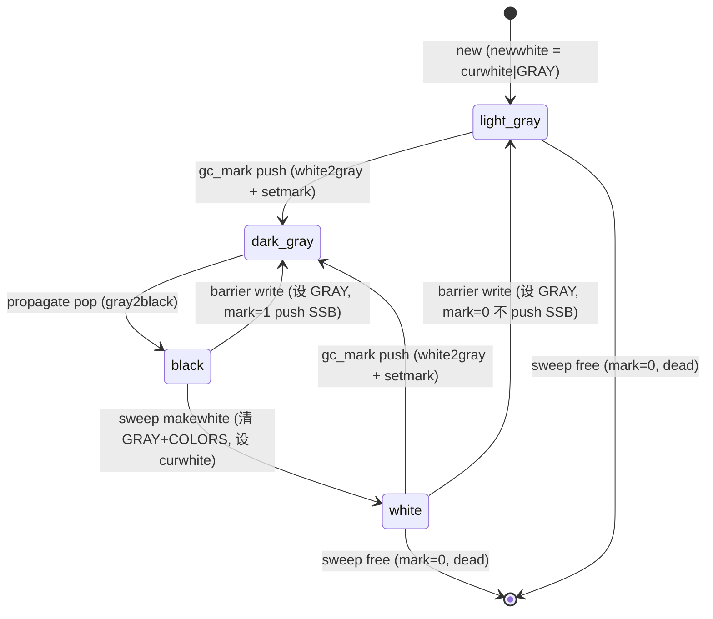

# 下一代 GC: Mark/Sweep 阶段适配计划

> 分支: `worktree-arenagc`
> 前置: arena 分配器已落地 (commit 7652357c)
> 目标路径(已与用户确认): **完整 quad-color(颜色迁入位图)+ per-arena gray stack + 优先级队列,单代先行**
> 范围: 把现有 tri-color 链表增量 GC 改成 arena-based quad-color 增量 GC 的 mark + sweep。分代(minor/major)留作后续独立阶段。
> **平台范围(已与用户确认): 仅 x64。** 本轮只改 `vm_x64.dasc` + `lj_asm_x86.h` + 架构无关的 C 代码。其他架构的 dasc/asm 同步留作后续(见 §1.4)。

---

## 0. 现状与目标的差距(一手核实)

### 0.1 对象现在活在两个并行世界

| 维度 | tri-color GC 在用 | arena 分配器在用 |
|------|------------------|-----------------|
| 对象组织 | `g->gc.root` 单链表(`GCRef nextgc`) | arena `block[]` 位图 + cell 索引 |
| 颜色 | 对象头 `marked` 字节(WHITE0/1, BLACK) | 不读颜色;`mark` 位仅作 Free 判别 |
| 灰对象 | `g->gc.gray`/`grayagain` 全局链表(`gclist` 字段串联) | `greytop`/`greybase` 字段已预留但**闲置** |
| 释放 | `gc_sweep` 遍历链表调 free 函数 | free 函数末端落到 arena 位图 |

当前 GC **完全不知道 arena 存在**;arena **完全不知道颜色存在**。两者唯一接触点是 `lj_mem_freegco_` 把死对象的 cell 标记为空闲,和 sweep 末尾的 `lj_arena_shrink`。

### 0.2 三个决定性的硬约束(核实自源码)

**(A) mark 位语义冲突**(`lj_arena.c:148-180`)
分配器为让热路径不碰位图,把 **bin 里的空闲块伪装成 White(block=1,mark=0)**,与"真正存活的 white 对象"在位图上无法区分。
→ 缓解:`arena_scavenge` 开头已有 "flush bins → 位图成唯一真相源" 的逻辑(`lj_arena.c:195-205`)。**GC mark 阶段开始前必须先 flush 所有 arena 的 bin**,使 (block,mark) 位真实反映 allocated/free。这是 mark/sweep 接入位图的前置不变量。

**(B) 颜色位散落在手写汇编里**(核实自 `vm_x64.dasc`)
解释器 **inline 发射 barrier**,直接读写 `tab->marked` 的 `LJ_GC_BLACK`、`gch.marked` 的 `LJ_GC_WHITES`:
- `barrierback` 宏(`vm_x64.dasc:377`)`and byte tab->marked, ~LJ_GC_BLACK`
- `TSETV/TSETS/TSETB/TNEW/TDUP` 多处 `test byte TAB->marked, LJ_GC_BLACK`(`vm_x64.dasc:1287,3902,3946,4003,4031,4056...`)
- upvalue 关闭路径 `test byte ...marked, LJ_GC_WHITES`(`vm_x64.dasc:3576,3600,3606`)
- **7 份 dasc 存在,但 x64 构建只编译 `vm_x64.dasc`**:vm_x64 / vm_x86 / vm_arm / vm_arm64 / vm_ppc / vm_mips / vm_mips64。本轮**只改 vm_x64.dasc**。

**(C) 颜色位也在 JIT 后端**(核实自 `lj_asm*.h`)
- IR opcode `IR_TBAR`/`IR_OBAR`(`lj_ir.h:132-133`),record 层 3 处生成(`lj_record.c:1679,1860`、`lj_ffrecord.c:262`)。
- `asm_tbar`(`lj_asm_x86.h:1931`)inline 发射 `and byte tab->marked, ~LJ_GC_BLACK` + 把 tab 挂到 `gc.grayagain`(用 `gclist` 字段!)。`asm_obar`(`:1946`)走 `lj_gc_barrieruv` C 调用。
- **5 份后端文件,x64 构建只编译 `lj_asm_x86.h`**(x86/x64 共用,按 `LJ_64` 分支):arm64 / arm / ppc / mips 后端不参与 x64 构建。本轮**只改 lj_asm_x86.h 的 LJ_64 分支**,各一套 `asm_tbar`/`asm_obar`。
- `asm_gc_check`/`asm_gcstep`(`lj_asm.c:1179-1191`)在分配点发射 GC 步进。

→ **结论**:"write barrier 只查 inline gray 位" 要在 **C 宏 + x64 dasc + x64 asm 后端** 同步改。**因为 LuaJIT 是单架构构建**(一次 `make` 只编译当前 TARGET 的 dasc/asm),x64 构建里其他 6 份 dasc 和其他 4 份 asm 后端**根本不参与编译**,所以只需 `vm_x64.dasc` + `lj_asm_x86.h` + 共享 C 宏三者一致即可跑通。这是本路径的最大风险面,但范围已收敛到 x64 三处一致。

**(D) marked 字节的位预算**(`lj_gc.h:17-25`)
```
0x01 WHITE0   0x02 WHITE1   0x04 BLACK     ← 迁出后空出 3 位
0x08 FINALIZED/WEAKKEY      0x10 WEAKVAL/CDATA_FIN
0x20 FIXED    0x40 SFIXED                  ← 这些保留(语义无关颜色)
```
迁出 white+black 后,**inline gray 位**可落在 `0x01`。FINALIZED/WEAK/FIXED 与颜色正交,继续留在 header。

### 0.3 图纸"sweep 不碰对象数据"在 LuaJIT 无法兑现 —— sweep 绕不开按类型分发

逐个核实 9 个 `gc_freefunc`(`lj_gc.c:384`),每类对象在"归还本体 cell"之外的副作用分三类:

| 副作用类别 | 对象类型 | 内容 |
|-----------|---------|------|
| **(1) 真·附属堆内存(dlmalloc,须单独释放)** | GCtab、lua_State | tab 的 hash part + 非 colocated array part(`lj_tab.c:218-221`);thread 的栈 + closeuv(`lj_state.c:395-396`) |
| **(2) 全局状态副作用(非内存,但 sweep 时必须执行)** | GCstr、GCupval、GCtrace、lua_State | str 的 `g->str.num--`(`lj_str.c:360`);upval 的 `unlinkuv`(`lj_func.c:104`);trace 的 `J->trace[]`/`freetrace`/gdbjit(`lj_trace.c:175-179`);thread 的 `cur_L`/`cts->L` 清悬垂 |
| **(3) 零附属(纯归还本体)** | GCproto、GCfunc、GCudata | free 函数只有一行 `lj_mem_freegco` |

**结论**:7 类对象里 5 类有非平凡副作用(类别 1+2),每个 dead 对象都得读它的 `gct`、可能读它的字段(str 读 `len`、thread 读栈指针)才能正确清理。**纯位图整字 sweep 只对类别 3(proto/func/udata)成立**,对其余类型不可能。

→ **因此 sweep 主循环无论如何都绕不开"按 `gct` 类型分发逐对象处理"**。位图在 sweep 阶段的价值是**快速定位**(扫 mark bitmap,O(metadata) 跳过整片存活/空闲区,而非 O(对象数) 走链表),**不是**"批量整字翻转省掉逐对象处理"。

### 0.4 Phase S 的简化决策(已与用户确认)

既然 sweep 绕不开类型分发,**本阶段 sweep 保持"逐对象处理",不拆 free 函数、不引入图纸的整字位图归还公式**:
- sweep 主循环改为:**扫 arena mark bitmap 定位 dead 对象**(mark=0 的已分配块首),对每个调用**现有的、原样不动的** `gc_freefunc[gct](g, o)`(它末端走 `lj_mem_freegco` 逐对象归还 cell,已落地验证)。
- 这样彻底回避计划早期版本里"free 函数双重改位图"的高风险点(free 函数仍是唯一改位图的地方,sweep 公式不介入)。
- 图纸的 `block'=block&mark` 整字 sweep 公式 + free 函数拆分,**留作后续性能优化阶段**(若 profiling 显示类别 3 对象的逐对象归还是瓶颈)。
- **真实收益**:相比链表 sweep,位图 sweep 跳过存活/空闲区不需逐个访问对象头(链表 sweep 每个对象都要读 `marked` + `nextgc`);non-traversable arena(string/cdata)整片可达时位图一眼跳过。收益是定位效率,据实设定,不夸大缓存红利。

---


## 1. 总体架构决策

### 1.0 颜色迁移分两小步(已与用户确认)

完整 quad-color 要 white/black 在 arena 位图、gray 位 inline 在 header。但 `marked` 字节 8 位全满(§0.2-D + Phase 0 核实:`0x80` 被 cdata `cdataisv` 占用)。为降低单步风险,**禁用 FFI** 腾出 `0x80`,拆成两步:

- **Step 1(本轮 Phase M)**:`LUAJIT_DISABLE_FFI` + **white/black 迁入 arena 位图**(复用 Phase 0 的 `arena_obj_setmark`/`ismarked`/`clearmark`)+ **gray 位 = `0x80`**(`LJ_GC_GRAY`)。mark/sweep/barrier 全部改走新表示。**关键依赖顺序**:white/black 必须和 gray 位一起迁——因为只有 black 进了位图(查它要访问元数据),"barrier 只查 inline gray 位"才有性能意义;若 white/black 留 header,`isblack` 本就 inline 便宜,单加 gray 位是纯增风险无收益(已与用户确认此依赖)。
- **Step 2(后续)**:gray 位从 `0x80` 搬到 `0x01`(white 腾出位),重新启用 FFI(cdata 走完整 quad-color)。

→ 本轮一步拿到完整 quad-color 收益(barrier 查 gray 位、mark/sweep 走位图),只是 cdata/FFI 暂缺席、gray 位暂栖 `0x80`。

#### Step 1 的颜色表示

`marked` 字节本轮布局(FFI 禁用,`0x80` 空出给 gray):
```
0x01/0x02 WHITE0/1  → 迁出,header 不再表 white(位空出,Step2 给 gray)
0x04 BLACK          → 迁出,header 不再表 black(可达性改由位图 mark 表示)
0x08 FINALIZED   0x10 WEAKVAL   0x20 FIXED   0x40 SFIXED   0x80 GRAY(本轮新增)
```

**white/black 迁入位图的具体编码**(arena 内对象,flush bin 后):
| 状态 | block | mark | gray(header 0x80) |
|------|-------|------|-------------------|
| White(未标记) | 1 | 0 | 0 |
| Light-gray(新分配/被写) | 1 | 0 | 1 |
| Dark-gray(已入 gray list) | 1 | 1 | 1 |
| Black(已遍历) | 1 | 1 | 0 |

- "可达" = mark 位(arena `mark[]`)。"待遍历" = gray 位(header `0x80`)。
- `iswhite(o)` = `!mark位 && !gray位`;`isblack(o)` = `mark位 && !gray位`;`isgray(o)` = `gray位`。
- **双白机制消失**:颜色在位图,不需要 WHITE0/WHITE1 翻转。sweep 末尾整字清 mark 位即"翻白"。`currentwhite`/`otherwhite`/`isdead` 语义需重新定义(见 Phase M)。
- **huge block / 非 arena 对象**:huge block 无位图,mark/gray 状态存独立 hash(本轮 FFI 禁用后 huge 对象只有超大 string/table/proto,数量少,可先简单处理)。


### 1.1 颜色编码(最终形态,Step 2 目标)

图纸 quad-color = 4 态,由 **segregated mark 位**(arena 位图,表"已标记/可达")+ **inline gray 位**(对象头 1 bit,表"在 gray stack 上待遍历")组合:

| 状态 | mark 位(位图) | gray 位(header) | 含义 |
|------|--------------|----------------|------|
| White | 0 | 0 | 未标记(可回收) |
| Light-gray | 0 | 1 | 新分配/被写;barrier 不触发 |
| Dark-gray | 1 | 1 | 已入 gray stack 待遍历 |
| Black | 1 | 0 | 已遍历完 |

最终形态下:flush bin 后 allocated 对象 (block,mark)=(1,0)=White,free 块=(0,1)。mark 阶段把存活对象 mark 位置 1 →(1,1)=Black。sweep 用图纸公式 `block'=block&mark`。gray 位放 `0x01`(white 腾出位)。

#### Quad-color 状态转移有向图(已实现)



**关键设计点:**
- **pure white**: sweep 后存活对象为纯 white(无 GRAY 位),区别于新分配的 light-gray。
- **barrier 区分两种转移**: 检查 arena mark 位 — mark=1(black)则 push SSB(dark-gray); mark=0(white)只设 GRAY(light-gray),避免无效 SSB 占用。
- **新分配 = light-gray**: `newwhite` 始终设 GRAY,barrier 不触发,GC 下轮 mark 时处理。

### 1.1' 颜色编码(本轮过渡形态,Step 1)

本轮 white/black 仍在 header,arena mark 位图**不表颜色**(仍是分配器的 Free 判别),只有 gray 位是新的:

| 状态 | header white/black | header gray 位(`0x80`) | 含义 |
|------|-------------------|----------------------|------|
| White | WHITE0/1 | 0 | 未标记 |
| Light-gray | WHITE0/1 | 1 | 新分配/被写;barrier 不触发(图纸 light-gray) |
| Dark-gray | (WHITE,在 gray stack) | 1 | 已 push 到 arena gray stack 待遍历 |
| Black | BLACK | 0 | 已遍历完 |

- **gray 位 = `marked & 0x80`**(`LJ_GC_GRAY`),仅 `LJ_HASGCMARK`(x64+arena,且本轮要求 FFI 禁用)下定义。
- mark/black 仍走 header(复用现有 `isblack`/`makewhite` 逻辑);**新增的是 gray 位的置位/清除 + push 到对象所在 arena 的 gray stack**(替代现有 `g->gc.gray` 全局链表)。
- barrier 改为查 gray 位(图纸:gray 位已置则不触发),而非现有的查 black + white。

### 1.2 gray 组织(per-arena gray stack + 优先级队列)

- 每个 traversable arena 一个 gray stack,用预留的 `greytop`/`greybase`(`lj_arena.h`)。stack 向下生长,初始带哨兵。
- **gray queue**:二叉堆优先队列,按各 arena gray stack 大小排序,优先处理最大的(图纸 §Gray Queue,缓存局部性)。
- non-traversable arena(string/cdata,`ArenaFlag_TravObjs`=0)**没有 gray stack**:它们的对象 mark 时直接 white→black(置 mark 位),不入栈,不遍历。
- huge block:无位图,用独立 hash table 存 {mark, gray} 元数据(图纸 §Huge Blocks)。本阶段 huge block 数量少,可先用线性数组或复用 arena 注册表式结构。

### 1.3 与现有链表的共存策略(关键风险控制)

**不一次性删除 `nextgc` 链和 `gclist`**。分两步:
1. **Phase M(mark)先并存**:mark 改用位图+gray stack,但 sweep 仍可走链表(过渡)。验证 mark 正确性独立于 sweep 改动。
2. **Phase S(sweep)再切位图**:sweep 改 per-arena 位图扫描,此时才停用 root 链表遍历。

`mmudata`(finalize 链)和 `mainthread->nextgc`(udata 链,`lj_gc_separateudata` 用)**保留不动** —— 它们与 sweep 机制正交,finalize 顺序语义依赖它们。

### 1.4 平台范围:仅 x64,其他架构留作后续

LuaJIT 是**单架构构建**:`make` 只编译当前 TARGET 的一份 dasc(x64→`vm_x64.dasc`,经 dynasm 生成 `buildvm`,再生成 `lj_vm.o`)和对应后端(`lj_asm_x86.h`,x64 与 x86 共用文件但按 `LJ_64` 分支)。其余 6 份 dasc、其余架构的 asm 分支**在 x64 构建里不参与编译**。

因此本轮:
- 改 `vm_x64.dasc` 的 barrier 宏 + 颜色位读写(§0.2-B 列出的点)。
- 改 `lj_asm_x86.h` 的 `asm_tbar`/`asm_obar`(LJ_64 分支)。
- 改架构无关的 C 宏(`lj_gc.h` 颜色宏 + barrier 函数)。
- **不碰** vm_x86/arm/arm64/ppc/mips*.dasc 和 lj_asm_arm64/arm/ppc/mips.h。

后续同步到其他架构时,新 GC 的着色/barrier 语义已在 x64 验证清楚,照搬即可。若需要在非 x64 上**临时编译**(如 CI),用编译门限 `LJ_HASGCARENA && LJ_TARGET_X64` 让非 x64 回退到 tri-color(见 §1.5)。

### 1.5 编译门限

新增 `LJ_HASGCMARK`(或复用 `LJ_HASGCARENA` 收紧):`LJ_HASGCARENA && LJ_TARGET_X64` 时启用 quad-color mark/sweep,否则即便开了 arena 分配器也走原 tri-color 链表 GC(arena 只做分配,sweep 走链表 + free 落位图,即当前已落地的状态)。这样:
- x64 + 开关 → 新 GC。
- 非 x64 + 开关 → arena 分配器 + 旧 tri-color(当前状态,已验证)。
- 关开关 → 完全原版。

---


## 2. 分阶段实现计划

### Phase 0 — 位图原语与 GC/分配器接口对齐(地基,低风险)

**目标**:把 mark/sweep 要用的位图操作做成 GC 和分配器共用的原语,并建立"mark 前 flush bin"不变量。

1. 在 `lj_arena.h`/`lj_arena.c` 提取/新增:
   - `lj_arena_flushbins(GCArena *a)` — 把所有 bin 块从伪 White 翻回 Free 位图态(复用 `arena_scavenge` 开头逻辑),供 GC 在 mark 开始前调用。
   - `arena_obj_setmark/ismarked/clearmark(a, cell)` — GC 标记原语(操作 `mark[]`)。
   - inline gray 位访问:`gcobj_setgray/isgray/cleargray`(操作 header `0x01`)。
   - 位图 sweep 原语(图纸公式,先实现 major):`arena_majorsweep(a)` = `block'=block&mark; mark'=block^mark`,逐 word,返回是否需调析构(返回 white→dead 的 cell 列表或回调)。
2. `lj_arena_shrink` 与新 sweep 的关系厘清:sweep 取代"释放整 arena"之外的部分,scavenge 合并仍保留。
3. **gc 颜色宏抽象层**:在 `lj_gc.h` 把 `iswhite/isblack/isgray/makewhite/...` 改成**可切换实现**——`LJ_HASGCARENA` 下走位图+gray位版本,否则走 header 版本。这样 §0.2 列出的 C 代码使用点(`lj_tab.c/lj_cdata.c/lj_api.c/...`)无需逐个改,只要宏语义对齐。

**验收**:Phase 0 不改变 GC 行为(宏在 arena 关时等价旧实现);新原语有独立 C 单测(扩展 `test/test_arena.c`):构造已知位图,验证 majorsweep 公式、flushbin 后状态正确。

---

### Phase M — Mark 阶段改造(高风险核心 1)

**目标**:mark 阶段用位图+per-arena gray stack+优先级队列,sweep 暂仍走链表(过渡验证)。

1. **gray stack 基础设施**(`lj_arena.c` 或新 `lj_gcmark.c`):
   - `arena_graypush(a, cell)` / `arena_graypop` / grow,用 `greytop`/`greybase`。
   - gray queue 二叉堆:`gcqueue_push/pop`,按 arena gray stack 深度排序。
2. **mark 入口改造**(`lj_gc.c`):
   - `gc_mark` / `gc_markobj` / `gc_marktv`:把"挂 gray 链"改成"置 mark 位 + 置 gray 位 + push 到对象所在 arena 的 gray stack";non-trav 对象直接置 mark 位(white→black),不 push。
   - `propagatemark`:从 gray queue 取最大 arena,drain 它的 gray stack,每个对象 `gc_traverse_*` 后清 gray 位(dark-gray→black)。`gc_traverse_tab/func/proto/thread/trace` 遍历逻辑**不变**(它们只调 gc_markobj)。
   - root 标记(`gc_mark_start`/`gc_mark_gcroot`):入口不变,内部走新 gc_mark。
3. **atomic 阶段**:`grayagain` 在 quad-color 下的角色 —— backward barrier 把表重新置 dark-gray 入栈。`atomic()` 末尾 flip 改为:不再 flip header currentwhite,而是 **mark 阶段结束 = 所有 gray stack 空**,存活对象 mark 位=1。弱表处理(`gc_clearweak`)逻辑保留。
4. **write barrier 改造(本阶段最危险)**:
   - C 宏 `lj_gc_barrierback`/`barrierf`/`objbarrier`:改成"检查/操作 gray 位"。`barrierback`(表):black→dark-gray = 清 mark 位的逆?**不**——quad-color backward barrier 是 black(mark=1,gray=0)→ dark-gray(mark=1,gray=1)再入栈。即只置 gray 位 + push,不动 mark。
   - **x64 dasc**(`vm_x64.dasc`):`barrierback` 宏(`:377`)改为操作 gray 位(`or byte tab->marked, LJ_GC_GRAY` + push 到 arena gray stack);各处 `test ...LJ_GC_BLACK`(`:1287,3902...`)、`test ...LJ_GC_WHITES`(`:3576,3600,3606`)按新 quad-color 语义改。改完重新 buildvm。**仅此一份 dasc**。
   - **x64 asm 后端**(`lj_asm_x86.h`,LJ_64 分支):`asm_tbar`(`:1931`)现在 `and ~LJ_GC_BLACK` + 挂 `gc.grayagain`(用 gclist),`asm_obar`(`:1946`)走 `lj_gc_barrieruv`。`asm_tbar` 改为置 gray 位 + push 到 arena gray stack —— 但 JIT 发射的 mcode 要访问 arena gray stack 较复杂。**权衡点**:建议**先让 x64 JIT barrier 退化为调用 C 函数 `lj_gc_barrierback`**(在 `asm_tbar` 里发 ccall 而非 inline),跑通后再决定是否 inline 回 mcode。**不碰其他架构后端。**
5. **fixed 对象**:`LJ_GC_FIXED`/`SFIXED` 对象(mainthread、保留字符串)在 mark 阶段视为永远 black(mark 位常 1),sweep 跳过。

**验收**:
- mark 后,用一个 verify 函数遍历所有 arena,断言可达对象 mark 位=1、不可达=0(与一个独立的 stop-the-world 朴素 mark 对照)。
- 全程 sweep 仍走旧链表 → 功能等价,test.lua + stress 通过。
- barrier 改造后用对抗测试:大量 black 表写 white 值,强制触发 barrier,验证不漏标(可临时把 barrier 触发率拉满做压力)。

---

### Phase S — Sweep 阶段改造(位图定位 + 逐对象释放,简化版)

**目标**:sweep 用位图**快速定位** dead 对象,逐对象调用**原样不动的** free 函数。停用 root 链表遍历。

> 设计取舍见 §0.4:sweep 绕不开按 `gct` 类型分发,故本阶段不拆 free 函数、不用整字位图归还公式。位图只负责"高效定位需要 sweep 的对象",释放仍逐对象走现有 `gc_freefunc`。

1. **位图 sweep 主循环**(`lj_gc.c` + `lj_arena.c` 新增 `arena_sweep`):
   - 遍历(增量地)每个 arena,扫 `block`/`mark` 位图找**已分配但未标记**的块首 = dead 对象:`block=1`(已分配块首)且 `mark=0`(未被 GC 标记可达)。这一步只读 metadata,跳过整片存活(mark=1)或空闲(block=0)的 word(`heads = block[w] & ~mark[w]`,一次 32 cells)。
   - 对每个定位到的 dead 块首,从 cell 读 `gch.gct`,调用 **现有的、原样不动的** `gc_freefunc[gct](g, o)` —— 它内部走 `lj_mem_freegco` 逐对象归还 cell(已落地验证),并执行该类型的全部副作用(§0.3 的类别 1+2)。
   - **存活对象**:mark=1 的对象,sweep 末尾需把 mark 位清 0(为下一轮重新标记做准备),相当于现有 `makewhite`。这一步可整字批量做(`mark[w] = 0` 对纯存活区),是位图唯一"批量"的地方——它不涉及对象数据,安全。
   - **关键不变量**:free 函数仍是唯一改 `block`/`mark` 位的地方(通过 `lj_mem_freegco`);sweep 主循环只**读** block/mark 定位、并在最后清存活对象的 mark 位。不存在"sweep 公式与 free 双重改位图"的冲突。
2. **mark 位与分配器 Free 位的协调**:sweep 调 `lj_mem_freegco` 归还 cell 时,分配器会把它设成 Free(01) 或 bin 伪 White(10)(§0.2-A)。sweep 进行中,"已 sweep 过的 dead 对象"已变 free、"未 sweep 的 dead 对象"仍是 (block=1,mark=0)、"存活"是 (block=1,mark=1)——三者位图可区分,增量 sweep 安全。
3. **finalize 衔接**:`lj_gc_separateudata` 在 mark 完成后(atomic)扫描需 finalize 的 udata,挂到 `mmudata`(仍走 `mainthread->nextgc` 链)并把它们 mark 位置 1(复活,不被本轮 sweep 回收)。位图 sweep 自然跳过 mark=1 的对象。这条路径(含 cdata finalizer、`gc_finalize` 复活)**完全不动**。
4. **增量性**:位图 sweep 按 arena 分块,维护 sweep 游标(当前 arena index + word 偏移),替代 `g->gc.sweep` 链表指针。增量 sweep 期间新分配对象 = light-gray(mark=0,gray=1)—— 但它们在 `celltop` 之后或新 arena,sweep 游标不会回扫到;且 sweep 只回收 `block=1 && mark=0` 的**已存在**块首,新对象的 block 位刚由 bump 置 1 但不在已 sweep 区,安全。
5. **string 等 non-traversable arena**:同样位图定位 + 逐对象调 `lj_str_free`(维护 `str.num` + interning 表)。这类 arena 整片存活时位图一眼跳过,是定位效率的主要受益者。
6. **停用 root 链表 sweep**:`gc_sweep`/`gc_sweepstr` 的链表遍历不再使用。`nextgc` 字段**保留**(`lj_gc_separateudata`/finalize 的 udata 链仍用),减少对象初始化改动面;只是不再用于 sweep 扫描。

**验收**:
- sweep 后存活集合与 Phase M 的 mark 结果一致,无误删/漏删(verify 函数对照朴素 GC)。
- free 函数零改动(diff 应只在 sweep 主循环 + arena 新增 `arena_sweep`),`lj_mem_freegco` 路径不变。
- test.lua + stress + ASAN 构建全过,失败集不超过 baseline。
- RSS 与分配器阶段相当或更好(sweep 后 `lj_arena_shrink` 仍释放空 arena)。
- 定位效率:大量存活对象场景,sweep 的对象头访问次数应显著低于链表 sweep(可加计数器验证位图跳过生效)。

---


### Phase V — 验证、性能、收尾

1. **正确性**:
   - 扩展 `test/test_arena.c` → `test/test_gc.c`:构造对象图,跑 mark/sweep,对照朴素 GC。
   - 整解释器 ASAN 构建(已验证可行)跑全套 + stress + 长跑保活/碎片脚本。
   - 对抗 workflow 审查(参考上轮):barrier 不变量、增量 sweep 中途暂停安全性、finalize 复活、弱表清除。
2. **性能**:mark/sweep 吞吐 vs 旧 tri-color GC(同 arena 分配器下);gray queue 缓存局部性收益量化;barrier 开销(JIT 退化 C 调用的代价)。
3. **JIT inline barrier 优化**(可选,若 C 调用退化代价大):把 gray stack push 的 fast path inline 回 dasc/asm。

#### Phase V 性能基线数据 (2026-06-18, inline barrier mark-check)

测试环境: x64 Linux, `-DLUAJIT_ENABLE_GCARENA -DLUA_USE_ASSERT -g`, static build.

**解释器 barrier 微基准** (隔离 barrier 开销, `-joff`, 2000 tables × 500 rounds):
| 测试 | 基线 (tri-color) | Arena GC | 差异 |
|------|-----------|-----------|------|
| Barrier (C call) | 0.022s | 0.040s | +81% |
| Barrier (inline bt) | 0.022s | 0.024s | **+4%** |

**综合基准** (median, 含 GC step 交互, 方差较大):
| 测试 | 基线 (tri-color) | Arena GC | 差异 |
|------|-----------|-----------|------|
| B1 mark 50K live tables | 0.431s | 0.529s | +23% |
| B2 sweep 100K dead | 0.002s | 0.002s | **-27%** |
| B3 deep chain 10K | 0.012s | 0.020s | +72% |
| B4 alloc 1M tables | 0.041s | 0.048s | +18% |
| B5 barrier 500K writes | 0.057s | 0.085s | +49% ← was +81% |
| B6 string churn 500K | 0.040s | 0.041s | +2% |
| B7 mixed 50% survival | 0.084s | 0.102s | +21% |
| B8 weak table 100K | 0.000s | 0.000s | 0% |
| B9 cdata 200K | 0.036s | 0.044s | +24% |
| B10 incr step 10K | 0.008s | 0.011s | +37% |
| B11 10 tables×10K keys | 0.881s | 0.604s | **-31%** |

**已完成优化**: 解释器+JIT SSB barrier, SSB flush→per-arena gray stack, 二叉堆优先队列, gc_mark SFIXED fast path, IRCALLCOND_GCMARK 条件编译, pure white makewhite + barrier mark-check(区分 white→light-gray / black→dark-gray), **解释器 inline barrier**(用 `bt` 指令检查 arena mark bitmap,消除 C call 开销, B5 barrier 从 +81% 降至 +4%).
**JIT barrier**: `asm_tbar` 仍走 C call `lj_gc_barrierback_arena`(JIT emit 层无 `bt` 指令支持,需新增 opcode 才能 inline; "skip if gray" 快速路径已保护热路径)。
**待做**: gc_mark/traverse 批量预取, B3 深链标记开销, B1 mark 遍历开销, JIT inline barrier(需在 lj_target_x86.h 新增 XO_BT).

---

## 3. 风险登记

| 风险 | 等级 | 缓解 |
|------|------|------|
| x64 dasc + asm barrier 与 C 宏改不一致 → 悬垂指针 | **高** | 只需 3 处一致(vm_x64.dasc + lj_asm_x86.h + C 宏),非 7+5;Phase M 先让 x64 JIT barrier 退化为 C 调用,只改 dasc;barrier 压力测试 |
| mark 位与分配器 Free 位语义纠缠 | 高 | Phase 0 建立 "mark 前 flush bin" 不变量 + 单测;图纸公式只在 flush 后成立 |
| 增量 mark/sweep 中途暂停的着色不变量 | 高 | quad-color light-gray 保护新对象;verify 函数在每步后抽查 |
| ~~free 函数双重改位图~~ → **已消除** | — | §0.4 决策:sweep 不拆 free、不用整字归还公式,逐对象走原 free 函数,free 仍是唯一改位图处 |
| huge block 无位图的 mark/sweep | 中 | 独立 hash table 元数据;本阶段数量少,可先简单实现 |
| 弱表/finalize/复活与位图交互 | 中 | 保留 mmudata/udata 链不动;复活对象 mark 位显式置 1 |
| 分代未做 → 单代 major-only 性能不如预期 | 低 | 已与用户确认单代先行;minor/major 位图公式已在 Phase 0 预留 |

## 4. 里程碑与依赖

```
Phase 0 (原语+宏抽象) ──┬─→ Phase M (mark+barrier) ──→ Phase S (位图sweep) ──→ Phase V (验证/性能)
                        │         ↑ 最高风险              ↑ 次高风险
                        └─ 单测先行,每 Phase 独立可验证(sweep 暂走链表 / mark 已切位图)
```

- **Phase 0** 可独立合入(不改 GC 行为)。
- **Phase M** 完成即可验证 mark 正确性(sweep 仍链表),是天然的中间可交付点。
- **Phase S** 才真正切到位图 sweep。
- 每个 Phase 都保持 `LUAJIT_ENABLE_GCARENA` 关闭时行为不变(旧 GC 完整保留)。

## 5. 本计划不含(明确排除)

- **非 x64 架构的 dasc/asm 适配**(vm_x86/arm/arm64/ppc/mips* + lj_asm_arm64/arm/ppc/mips.h)。x64 验证清楚后照搬,属后续阶段。本轮非 x64 编译时新 GC 关闭、走原 tri-color(§1.5)。
- 分代 minor/major 自动切换、对象 aging、跨代 barrier(下一独立阶段;位图公式已预留)。
- ~~SSB(sequential store buffer)——图纸的 barrier 优化~~ → **已完成**,解释器+JIT 均已实现 SSB push,flush 在 atomic 前执行。
- 与你之前 gen-gc 分支工作的合并(trace 必须 OLD 等问题属分代范畴)。
- ~~x64 JIT inline barrier 的极致优化~~ → **已完成**,asm_tbar 已 inline SSB push(callee-save 寄存器分配,overflow 走 C call)。
- **sweep 的整字位图归还公式 + free 函数拆分**(§0.4):本阶段 sweep 逐对象调原 free 函数,只用位图定位。整字 `block'=block&mark` 归还公式留作后续性能优化,仅当 profiling 显示类别 3(proto/func/udata)的逐对象归还是瓶颈时才做。
